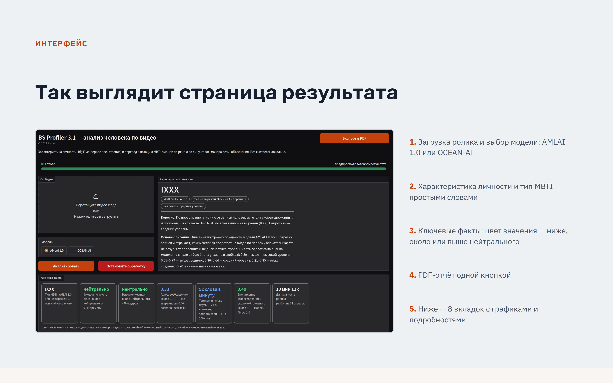
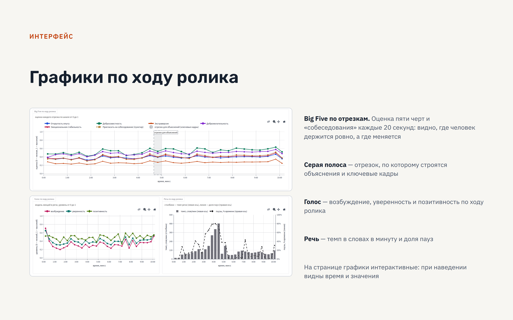
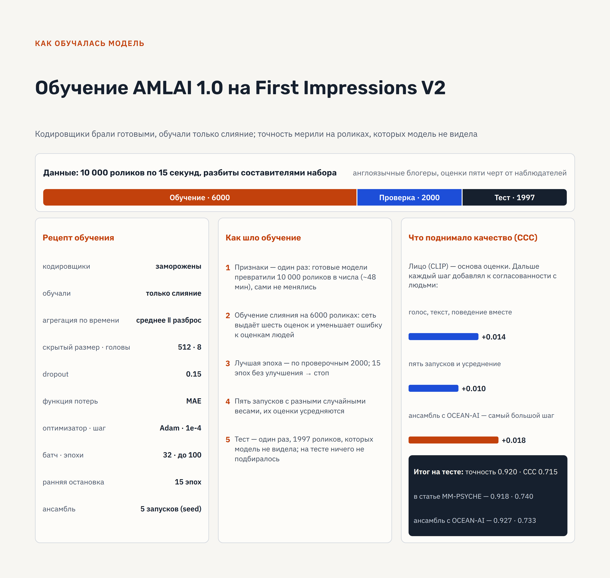

# BS Profiler 3.1 — анализ человека по видео: Big Five, тип MBTI, эмоции, голос, мимика, речь

Локальная программа: на входе видеофайл с говорящим в кадре человеком, на выходе — оценка пяти черт личности
Big Five, тип MBTI, эмоции, голос, мимика, манера речи, объяснения и печатный отчёт PDF. Всё считается на одном
компьютере: видео и результаты никуда не отправляются.

## Что в этой папке

| Файл или папка | Что это |
| --- | --- |
| `bs3-studio/` | исходный код версии 3.1: пакет `bs3`, команда `bs3`, веб-интерфейс на порту 7880 |
| `BS_Profiler_3.1_презентация.pptx` | презентация проекта (9 слайдов): конвейер, модель, обучение, интерфейс, тип MBTI, стек, что нужно для развития |
| `Инструкция_для_оценщиков.md` | как живые люди оценивают ролики по пяти чертам и заполняют таблицу — эталон для проверки системы |
| `Письма_авторам.md` | письма авторам OCEAN-AI (корпус MuPTA) и MM-PSYCHE / SSL-MEPR (веса моделей) с адресами, на русском и английском |

## Что нового в 3.1

- **Выбор модели.** На странице переключатель: AMLAI 1.0 (наша, по умолчанию) или OCEAN-AI (веса MuPTA).
  Один анализ — одна модель; второго мнения и усреднения на странице больше нет.
- **Тип MBTI.** Пять черт Big Five переводятся в тип MBTI по формуле заказчика (порог 0.5, пограничная зона «X»),
  тип считается и по всему ролику, и по каждому отрезку.
- **Характеристика личности** простыми словами и «Ключевые факты» с цветной подсветкой значений.
- **Только русская речь.** Продукт рассчитан на русскоязычные ролики.
- **Приватность.** Сервер отдаёт только то, что показано на странице; файлы заданий по прямой ссылке не скачиваются;
  папки заданий получают непредсказуемые имена.

## Как это выглядит

Страница результата — характеристика личности, тип MBTI и «Ключевые факты»:



Графики по ходу ролика (одинаковые на странице и в PDF-отчёте):



Как обучалась модель AMLAI 1.0:



**Вся презентация (9 слайдов):** [BS_Profiler_3.1_презентация.pptx](BS_Profiler_3.1_презентация.pptx)

## Что система выдаёт по ролику

| Анализ | Чем считается | Что получается |
| --- | --- | --- |
| Big Five | выбранная модель: AMLAI 1.0 или OCEAN-AI | пять черт, метка «собеседование», оценки по ходу ролика |
| Тип MBTI | пересчёт из Big Five по формуле заказчика | тип за весь ролик и по каждому отрезку, пограничные оси |
| Эмоции по смыслу речи | EmoRoBERTa (`michellejieli/emotion_text_classifier`) | семь эмоций по каждому отрезку и средний профиль |
| Голос | wav2vec2 (`audeering/wav2vec2-large-robust-12-ft-emotion-msp-dim`) | возбуждение, уверенность, позитивность |
| Мимика | `trpakov/vit-face-expression` по кропам лица MediaPipe | семь выражений, движение головы, доля кадров с лицом |
| Манера речи | транскрипт Whisper с метками времени, без моделей | темп, паузы, слова-заполнители, длина фразы, разнообразие словаря |
| Объяснения (только AMLAI 1.0) | вклад модальностей, ключевые кадры, слова | почему получилась такая оценка |

Результат — интерактивная страница с восемью вкладками (графики plotly) и PDF с теми же графиками. Тексты
на русском: описания поведения и транскрипт при необходимости переводит локальная языковая модель.

## Как устроено

Ролик делится на отрезки по 20 секунд, каждый отрезок проходит весь конвейер целиком:

- лицо — 30 кадров отрезка, поиск лица MediaPipe, признаки CLIP ViT-B/32;
- голос — звук этих 20 секунд целиком, признаки CLAP;
- смысл речи — вся речь отрезка, Whisper переводит её в текст, признаки EmoRoBERTa;
- поведение — 16 кадров отрезка, Qwen-VL пишет, что делает человек, признаки EmoRoBERTa.

Четыре набора признаков сводит вместе графовая модель слияния — единственная часть, которую я обучил сам
(6000 роликов First Impressions V2, пять запусков с усреднением). Готовые кодировщики не дообучались.
Рецепт признаков и архитектура слияния взяты из статьи MM-PSYCHE (LEYA-HSE, IEEE Access 2026):
<https://doi.org/10.1109/ACCESS.2026.3723020>, код — <https://github.com/LEYA-HSE/MM-PSYCHE>.

## Точность (тестовая часть First Impressions V2, 1997 роликов)

| Система | mACC | CCC |
| --- | ---: | ---: |
| OCEAN-AI, готовые веса FIV2 | 0.9255 | 0.703 |
| AMLAI 1.0, среднее пяти запусков | 0.9202 | 0.715 |
| Однозадачная модель из статьи MM-PSYCHE | 0.918 | 0.740 |

Метка «собеседование»: ACC 0.922, CCC 0.762. Усреднение AMLAI 1.0 и OCEAN-AI даёт 0.9274 / 0.733 (проверено
бутстрепом), но в 3.1 модели работают по отдельности. На русскоязычных роликах точность не измерена —
размеченных русских данных в открытом доступе нет; что нужно, чтобы её измерить, — в `Инструкция_для_оценщиков.md`.

## Что нужно для запуска

- Ubuntu 24.04 (в том числе WSL2 под Windows 11), Python 3.12, `ffmpeg`, `poppler-utils`, видеокарта NVIDIA
  (проверено на RTX 5090 Laptop, 24 ГБ).
- Ollama с моделью `qwen2.5vl:7b` — описание поведения по кадрам и перевод текстов на русский.
- Питоновские пакеты — точные версии в `bs3-studio/requirements-wsl.txt` (torch 2.11 cu130, `transformers` 4.45.1,
  `gradio` 5.8, `plotly` 7.1, `matplotlib`, `fpdf2`, `mediapipe`, `opencv-python`, `librosa`, `soundfile`,
  `opensmile`, `oceanai`, `pandas`, `numpy`).
- Веса моделей в репозиторий не кладутся:
  - OCEAN-AI (веса MuPTA и FIV2) — скачиваются при первом запуске в `~/bs/models`;
  - чекпоинты AMLAI 1.0 (пять файлов по 24 МБ) — из релиза
    <https://github.com/AML1969/bigfive-video/releases/tag/v1.0.0>, распаковать в `~/bs/mm_runs_seeds/seed*/best.pt`;
  - модели эмоций, голоса и выражений (около 1.5 ГБ) скачиваются с Hugging Face при первом запуске.

Полная установка с нуля описана в `bs3-studio/README.md`.

## Запуск

```bash
python3 -m venv ~/bs/venv
~/bs/venv/bin/pip install -r malitski/bs3-studio/requirements-wsl.txt
~/bs/venv/bin/pip install --no-deps -e malitski/bs3-studio
bash malitski/bs3-studio/scripts/run_web3.sh          # веб: http://localhost:7880
```

Командная строка без веба (русская речь):

```bash
~/bs/venv/bin/bs3 infer video.mp4 --backend mm --out result.json      # AMLAI 1.0
~/bs/venv/bin/bs3 infer video.mp4 --backend oceanai --out result.json # OCEAN-AI
```

Рабочие папки программы — `~/bs3_data/{web_jobs,logs,gradio_tmp}`. Обработка занимает примерно столько же времени,
сколько длится сам ролик. Подробности — в `bs3-studio/README.md`.

## Чего здесь нет

- Видеозаписей и результатов обработки: это персональные данные, они остаются на компьютере.
- Весов моделей: качаются отдельно, см. выше.

## Оговорки

Big Five здесь — «кажущаяся» личность по первому впечатлению наблюдателей, а не результат опросника: разметка
First Impressions V2 сделана краудсорсингом по пятнадцатисекундным роликам. Тип MBTI пересчитывается из Big Five
по опубликованным соответствиям шкал и не измеряется опросником. Модели эмоций, голоса и выражений обучены на
англоязычных корпусах и фотографиях, их выходы — относительные сигналы о поведении, поэтому смотреть нужно на
изменения по ходу ролика, а не на абсолютные доли. Метка «собеседование» — не рекомендация о найме.

© 2026 AMLAI
